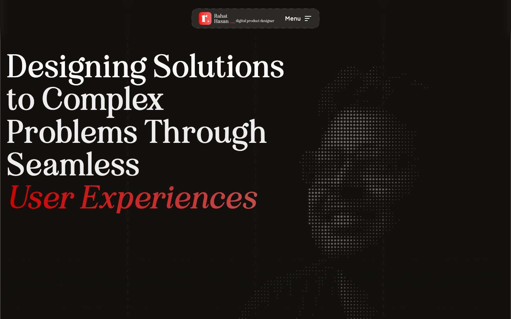
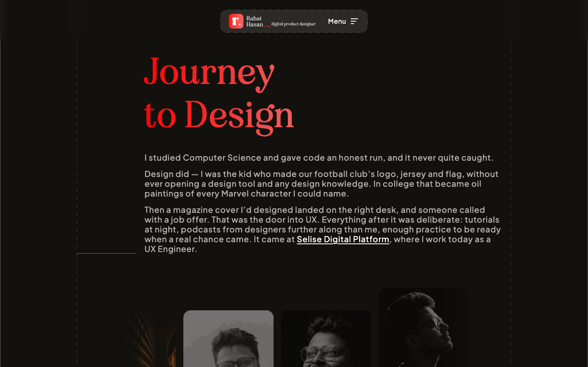
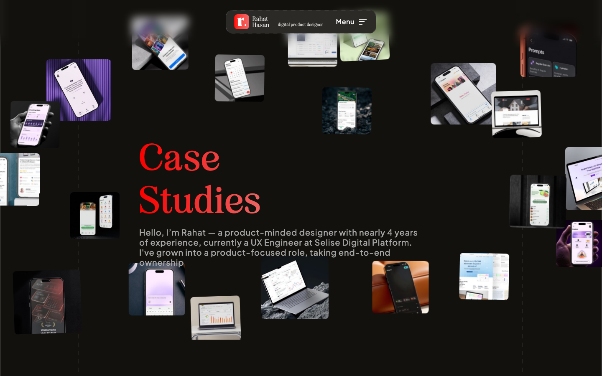
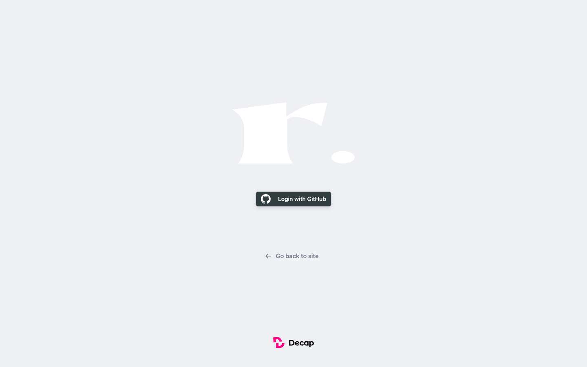
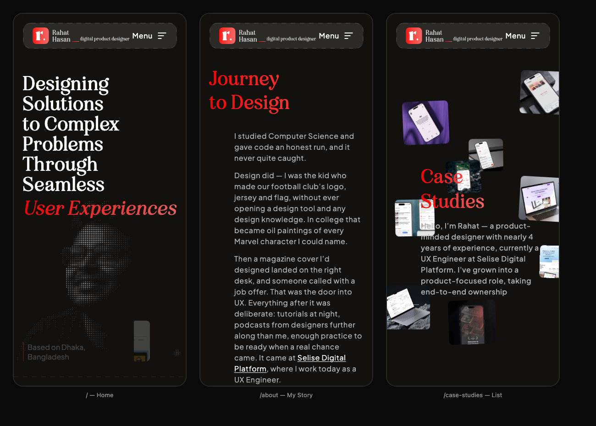

# Understanding this project — a beginner's guide

You designed this site and you own it. This document explains what every part of
it is, in plain language, so that nothing in the folder feels like a black box.

**You do not need to read this top to bottom.** Use it as a reference. The two
most useful sections are [The folder map](#3--the-folder-map) and
[Recipes](#10--recipes-common-jobs).

Related documents:
- [CONTENT-GUIDE.md](../CONTENT-GUIDE.md) — where every piece of text lives (Bangla)
- [CMS.md](CMS.md) — using the `/admin` editor
- [PROJECT-GUIDE-BN.md](PROJECT-GUIDE-BN.md) — this same document in Bangla

---

## 1 · What this project actually is

It is a **website made of small text files**. There is no database and no server
that "runs" your site. When you publish, a program reads your files and produces
a folder of finished pages, and a host puts that folder on the internet.

That's the whole idea. Everything below is detail.

Four pages exist:

| Address | What it is | File that draws it |
|---|---|---|
| `/` | Home | `src/components/` (several, stacked) |
| `/about` | My Story | `src/components/AboutPage.jsx` |
| `/case-studies` | The list | `src/components/CaseStudies.jsx` |
| `/case-studies/d-pass` | One case study | `src/components/CaseStudyDetail.jsx` |


*`/` — the homepage, 1440px wide*


*`/about` — the My Story page*


*`/case-studies` — the list page*

---

## 2 · The words you'll keep hearing

| Word | What it means for you |
|---|---|
| **React** | The system that builds pages out of reusable blocks |
| **Component** | One block. A `.jsx` file. The header is a component, the footer is a component |
| **JSX** | The language inside `.jsx` files — HTML and JavaScript mixed together |
| **Vite** | The tool that runs your site while you work, and packages it when you publish |
| **Tailwind** | Styling written as short words in the markup: `text-white`, `mt-[20px]` |
| **GSAP** | The animation library — everything that moves on scroll |
| **Lenis** | Makes scrolling feel smooth instead of steppy |
| **Build** | Turning your source files into the finished `dist/` folder |
| **Deploy** | Putting `dist/` on the internet |
| **Repo** | Your project folder, with its full history, stored on GitHub |
| **Commit** | One save point in that history. You can always go back to one |

---

## 3 · The folder map

```
Rahat | Portfolio/
│
├── index.html            ← the empty shell every page starts from
├── package.json          ← the list of tools this project uses
├── vite.config.js        ← settings for the build tool
├── vercel.json           ← settings for the host
│
├── src/                  ← ALL THE CODE THAT DRAWS THE SITE
│   ├── main.jsx          ← the very first file that runs
│   ├── App.jsx           ← decides which page to show
│   ├── index.css         ← fonts, colours, type sizes, shared rules
│   │
│   ├── components/       ← one file per visual block
│   ├── lib/              ← small helpers (routing, SEO, access codes)
│   ├── hooks/            ← reusable bits of behaviour
│   └── data/             ← turns /content into something the pages can use
│
├── content/              ← YOUR WORDS. Edited by you or by /admin
│   ├── settings.json     ← access code, contact email
│   └── case-studies/     ← one .json file per case study
│
├── public/               ← files copied to the site untouched
│   ├── assets/           ← every image
│   ├── fonts/            ← the typefaces
│   └── admin/            ← the CMS editor page
│
├── scripts/              ← programs that run automatically at build time
├── docs/                 ← this guide, the CMS guide, the talk
└── dist/                 ← THE FINISHED SITE (generated — never edit by hand)
```

### The components, one line each

| File | Lines | What it draws |
|---|---|---|
| `Hero.jsx` | 352 | The big headline and the dotted portrait |
| `HeroDotPortrait.jsx` | 177 | The portrait made of dots |
| `About.jsx` | 135 | The short about strip on the homepage |
| `Logos.jsx` | 167 | The scrolling logo row |
| `CaseStudy.jsx` | 325 | The sideways case-study rail on the homepage |
| `AngleMarque.jsx` | 193 | The big pinned quote with drifting images |
| `Footer.jsx` | 481 | Booking widget, skills, links — on every page |
| `Menu.jsx` | 577 | The floating header and the menu |
| `Loader.jsx` | 227 | The loading screen between pages |
| `AboutPage.jsx` | 817 | The whole My Story page |
| `CaseStudies.jsx` | 410 | The case-studies list |
| `CaseStudyDetail.jsx` | 386 | The template one case study is poured into |
| `PinGate.jsx` | 290 | The "enter the access code" box |
| `SkillsGrid.jsx` | 233 | The skills block in the footer |
| `HexGrid.jsx` | 215 | The little code-looking grid decoration |
| `ErrorBoundary.jsx` | 55 | Catches a crash so the page doesn't go blank |

**`AboutPage.jsx` is the biggest file at 817 lines.** That's normal — it's a
whole page in one file, holding both the desktop and the mobile version.

---

## 4 · How a page gets on screen

```
Someone opens rahat-uxd.vercel.app/about
        ↓
index.html loads (an empty shell)
        ↓
main.jsx runs
        ↓
App.jsx looks at the address: "/about"
        ↓
App.jsx renders AboutPage.jsx
        ↓
AboutPage.jsx reads its text from constants at the top of the file
        ↓
GSAP starts the scroll animations
```

`App.jsx` is worth understanding because it is the switchboard. In plain
language, it says:

> If the address is `/about`, show the About page.
> If it's a case study and it's still locked, show the list with the code box on top.
> If it's a case study and it's unlocked, show the case study.
> If it's `/case-studies`, show the list.
> Otherwise, show the homepage — which is Hero, About, Logos, CaseStudy, AngleMarque, Footer stacked in order.

That last line is why the homepage sections appear in the order they do. To
reorder the homepage, you reorder those lines in `App.jsx`.

---

## 5 · Addresses (routing)

`src/lib/router.js` is a tiny custom router — about 88 lines.

It used to use `#about` style addresses. Those were changed to real paths
(`/about`) because a `#` fragment is invisible to Google and to link previews —
every page was reporting itself as the homepage. Old `#` links still work; they
get rewritten automatically.

**Why this matters to you:** each page now has its own title, its own
description and its own preview card when shared. That's handled in
`src/lib/seo.js`, which is also the single place the live domain is written:

```js
export const SITE_URL = "https://rahat-uxd.vercel.app";
```

Change the domain there and everything else follows.

---

## 6 · Where your words live

There are **two kinds of text** in this project, and knowing which is which
saves a lot of confusion.

**Kind 1 — text inside a component file.** Page headings, the story paragraphs,
the job list. These sit in clearly-named constants at the top of the file:

```js
const STORY_INTRO = [
  "I studied Computer Science and gave code an honest run…",
  "Design did — I was the kid who made our football club's logo…",
];
```

Edit between the quote marks. Don't touch the brackets, the `const`, or the
semicolon. Full map of these: [CONTENT-GUIDE.md](../CONTENT-GUIDE.md).

**Kind 2 — case study content.** This lives *outside* the code, as JSON, in
`content/case-studies/`. One file per study. This is what `/admin` edits.

The reason for the split: case studies change often and are the thing you'd want
to edit from a browser without opening a code editor. The page headings change
almost never.

---

## 7 · The `/admin` editor


*`/admin` — Decap CMS, signed in with GitHub*

Publishing from `/admin` does this:

```
You press Publish
   ↓
Decap writes a JSON file into content/case-studies/ on GitHub
   ↓
That's a commit — a save point in your history
   ↓
Vercel notices and rebuilds
   ↓
About two minutes later it's live
```

So the CMS isn't a separate system with its own database. It edits the same
files you could edit by hand. See [CMS.md](CMS.md) for setup and use.

> **Note:** `/admin` used to break when opened without a trailing slash — it
> asked for the config file at the wrong address and showed a YAML error. Fixed
> by pointing at the config by absolute path in `public/admin/index.html`. If you
> ever see *"Error loading the CMS configuration"*, that's the area to look at.

---

## 8 · The case study access code

Case studies are client work, so they're kept out of public search behind a
4-digit code.

- The code lives in `content/settings.json` (`"accessCode": "1453"`) and is
  editable from `/admin` → Settings
- Unlocking one study opens **only** that study; another study asks again
- An unlock lasts 30 minutes (`accessMinutes`), then asks again
- It's remembered in the browser, per study

**Be honest about what this is:** it's a courtesy gate, not security. It keeps
client work off casual public search. Anyone determined can get past it. The
code comments in `src/lib/caseAccess.js` say exactly this.

Detail pages are also marked `noindex` so search engines skip them, while the
public pages stay indexed.

---

## 9 · Desktop, tablet and mobile

The site was originally built at a fixed 1440px. It now adapts. Three techniques
do the work:

**1 · Fluid type.** Type sizes are ranges, not fixed numbers, so they shrink
smoothly with the screen instead of jumping at a breakpoint. In `src/index.css`:

```css
--text-display: clamp(38px, 5.9vw, 84px);
```

Read as: never smaller than 38px, never bigger than 84px, and in between it
scales with the window.

**2 · Two layouts in one file.** Tailwind prefixes pick the layout:
`max-lg:` applies below 1024px, `lg:` applies at 1024px and above. So one
component holds both versions — which is why there is no separate mobile
codebase to keep in sync.

**3 · Different animation per size.** GSAP's `matchMedia` runs different
animation on phones. The homepage case-study rail scrolls sideways while pinned
on desktop; on a phone the same cards stack vertically and fade in. Pinned
sideways scrolling on a touch screen is a bad idea, so it isn't used there.


*The three main pages at 375px — home, about, case studies*

---

## 10 · Recipes (common jobs)

### Run the site on your machine

```bash
npm run dev
```

Then open `http://localhost:5173`. Save a file and the browser updates itself.
Stop it with `Ctrl+C`.

### Run the editor locally

```bash
npm run cms
```

In a second terminal, with `npm run dev` still going. Then open
`http://localhost:5173/admin`.

### Build the finished site

```bash
npm run build
```

Writes `dist/`. You'll see it print each page as it's created. If this command
fails, **do not publish** — something is broken.

### Change a piece of text

1. Find it in [CONTENT-GUIDE.md](../CONTENT-GUIDE.md)
2. Open that file, change the words between the quote marks
3. Save, look at the browser
4. Commit

### Add a case study

Use `/admin` — that's what it's for. The manual route is a new `.json` file in
`content/case-studies/` copying the shape of an existing one. Images go in
`public/assets/`; their dimensions get measured automatically at build time by
`scripts/image-sizes.mjs`, so you never enter them by hand.

### Change the access code

`/admin` → Settings. Or edit `content/settings.json` directly.

### Change the live domain

`SITE_URL` in `src/lib/seo.js`. One place.

### Save your work

```bash
git add -A
git commit -m "Describe what you changed"
git push
```

Vercel rebuilds automatically. Live in about two minutes.

---

## 11 · When something breaks

**The golden rule: you can always go back.** Every commit is a save point.

| Symptom | Likely cause |
|---|---|
| Blank white page | A typo in a `.jsx` file — a missing `"` or `,` |
| Text shows `${...}` literally | Backticks/braces damaged in a template string |
| Page loads, one section gone | An animation error — check the browser console |
| `npm run build` fails | Read the last few lines; it names the file and line |
| "Error loading the CMS configuration" | The `/admin` config path — see section 7 |
| Everything is broken | `git checkout .` throws away uncommitted changes |

To see the error, open the site in Chrome, right-click → Inspect → Console tab.
Red text is the error. Copy it — it names a file and a line number.

**Never edit `dist/`.** It's regenerated on every build; your changes vanish.

---

## 12 · Things worth knowing

- **`dist/` and `node_modules/` are not your work.** Both are generated. If
  they're deleted, `npm install` and `npm run build` bring them back.
- **`.gitignore`** lists things Git deliberately ignores, including the old
  duplicate `Rahat-Portfolio/` folder.
- **`api/auth.js` and `api/callback.js`** are the two small functions that let
  the CMS log in with GitHub. They only run on Vercel.
- **`scripts/prerender.mjs`** writes a real HTML file for every page after each
  build, plus `robots.txt` and `sitemap.xml`. That's what makes each page
  linkable and findable.
- **The comments in the code are written for you.** Most files start with a
  block explaining what the file is and why it's built that way. They are worth
  reading — they were written to be read by someone who isn't a developer.

---

## 13 · Two open items

Small things noticed while writing this, neither urgent:

1. On `/case-studies`, the intro paragraph slightly overlaps one of the
   scattered background images on both desktop and mobile — see the screenshots
   in section 1 and 9. Cosmetic, but visible.
2. The main JavaScript bundle is about 505KB (170KB compressed). Fine for a
   portfolio; worth revisiting if the site ever feels slow on a poor connection.
